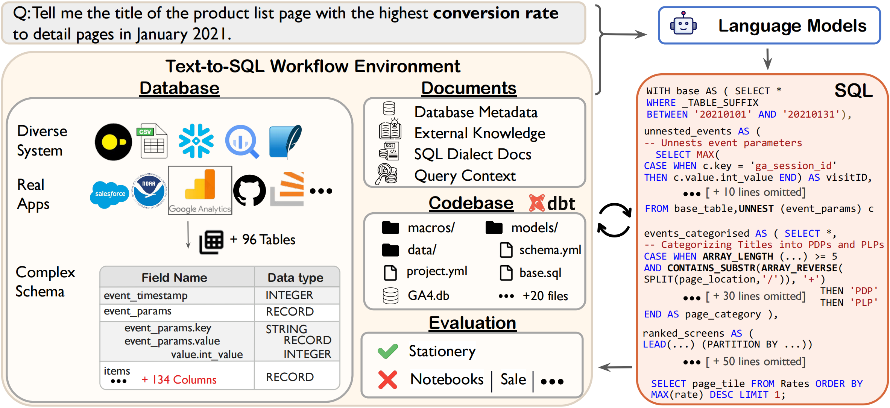

# Spider 2.0: Evaluating Language Models on Real-World Enterprise Text-to-SQL Workflows


## 📰 News

- 2024-08-28: We released a smaller version of Spider 2.0 (~ 25% of the full dataset) containing 190 examples to give users early access. The full dataset and the paper will be available in two weeks. Stay tuned! 🤗

## 👋 Overview





### Why Spider 2.0?

In 2018, our group proposed [Spider 1.0](https://yale-lily.github.io/spider), which has been widely used in Text-to-SQL research. 

However, real-world enterprise-level Text-to-SQL workflows often involve complex databases and require advanced SQL queries across diverse operations. 

<!-- **We lack a comprehensive and challenging testbed that encapsulates these phenomena, essential for advancing the capabilities of these models and evaluating their true potential in code generation, specifically in text-to-SQL tasks.** -->

<!-- However, real-world enterprise-level Text-to-SQL workflows often involve: 
1. Complex cloud or local data across various database systems with significantly larger schema.
2. The need to employ diverse operations from data transformation to analytics tasks.
3. The need to use multiple nested sub-queries in various dialects to complete sophisticated tasks.

These workflows typically process natural language analytic questions, yet we lack a comprehensive and challenging testbed that encapsulates these phenomena, essential for advancing the capabilities of these models and evaluating their true potential in code generation, specifically in text-to-SQL tasks. -->


To this end, we introduce Spider 2.0, an evaluation framework comprising 600 real-world text-to-SQL workflow problems derived from enterprise-level database use cases. 

We evaluated Spider 1.0, BIRD, and Spider 2.0 using the popular frameworks [Dail-SQL](https://github.com/BeachWang/DAIL-SQL) and [CodeS](https://github.com/RUCKBReasoning/codes).

|                 | Spider 1.0 dev | Spider 1.0 test | BIRD test | Spider 2.0 |
| --------------- | -------------- | --------------- | --------- | ---------- |
| DailSQL + GPT-4 | 82.4           | 86.6            | 57.4      | 6.0        |
| CodeS-7B        | 85.4           | -               | 59.3      | 1.3        |


## 🚀 Quickstart


### Spider 2.0
For [`Spider 2.0`](./spider2/README.md), all evaluation examples are aggregated in file [`spider2.jsonl`](./spider2/evaluation_examples/spider2.jsonl), where each data point contains the following field:
```json
{
    "instance_id": "3a348be1-aed2-44fb-8185-c66c9d14a6ef",
    "instruction": "Please tell me the number of sessions for each website traffic channel in December 2020.",
    "type": "Bigquery"
}
```
For each instance, we also provide a separate folder [`./spider2/evaluation_examples/{instruction_id}`](./spider2/evaluation_examples/) as its **Execution Contetxt** to simulate the agentic setting. Each folder may have the following files:

- `README.md`: detailed requirements of the `instruction` field for the current example with `instance_id`;
- `*_credential.json`: credential file connecting to realistic enterprise-level databases, e.g., BigQuery. Can be replaced with your OWN;
- `result.csv`: CSV file to store the execution results;
- other instance-specific materials which assist in finishing the current task:
    - 🏗️ partial project, e.g., [`dbt_project/`](./spider2/evaluation_examples/43d5ad49-0f99-4b90-a6df-d3afc5c216ff/).
    - 🎞️ query history or samples, e.g., [QUERY_HISTORY/](./spider2/evaluation_examples/1d009ac3-1c75-447b-a7e0-49ccc2b5fbf9/FIREBASE_QUERY_HISTORY/), [BASIC_SQLS/](./spider2/evaluation_examples/e4a35097-4ff3-4ca7-8304-f593e039735b/BASIC_SQLS), etc.
    - 📝 reference documentation: [`ga4_dimensions_and_metrics.md`](./spider2/evaluation_examples/3a348be1-aed2-44fb-8185-c66c9d14a6ef/ga4_dimensions_and_metrics.md), [`retention_rate.md`](./spider2/evaluation_examples/22faca18-f766-46f5-a22b-c79de56fb6ec/retention_rate.md), etc.
    - 🔍 query interface: We have predefined how to access the diverse database systems.

<!-- - `instance_id`: (str) - A formatted instance identifier, UUID
- `instruction`: (str) - The instruction
- `type`: (str) - [Local, Bigquery, DBT, Snowflake]
- `./evaluation_examples/instanceid/*`: evaluation context
[`evaluation_examples`](https://github.com/xlang-ai/Spider2/tree/main/spider2/evaluation_examples). -->

🤗 Feel free to devise your intelligent agent and resolve the task defined in `instruction` field and `README.md`.


#### Run Spider-Agent

```
git clone https://github.com/xlang-ai/Spider2.git
cd methods/spider-agent

# Optional: Create a Conda environment for Spider 2.0
# conda create -n spider2 python=3.11
# conda activate spider2

# Install required dependencies
pip install -r requirements.txt

export OPENAI_API_KEY=your_openai_api_key
python run.py --model gpt-4o --suffix test1
```


### Spider 2.0-Lite

To meet the needs of the research community, we've also organized the Spider 2.0 data in a format similar to Spider 1.0. [`Spider 2.0-Lite`](https://github.com/xlang-ai/Spider2/tree/main/spider2-lite#spider-20-lite) covers 90% of examples from Spider 2.0 that are sampled to be more lightweight and standalone, with a focus on evaluating LLMs on classic Text-to-SQL.

Each file in `spider2-lite.json` contains the following fields:
- `instance_id`: the unique example id
- `db`: the database id to which this question is addressed
- `question`: the natural language question
- `external_knowledge`: the filenames of external knowledge, documentation, and information required to answer this question are stored in documents
- `plan`: detailed instruction / reference plan for solving this problem
- `special_functions`: special functions that may be needed to answer this question

> **Note that** `plan` and `special_functions` are **not** standard inputs of Spider 2.0 challenge; they are used for ablation experiments and analysis.


We proposed baselines based on the widely used text2sql methods: [`Dail-SQL`](https://github.com/xlang-ai/Spider2/tree/main/spider2-lite/baselines/dailsql#installation) and [`CodeS`](https://github.com/xlang-ai/Spider2/tree/main/spider2-lite/baselines/codes#installation), with evaluation results reported :test_tube:.

#### Run Dail-SQL

Set up the environment and dependencies:

```bash
conda create -n DAIL-SQL python=3.8
cd spider2-lite/baselines/dailsql
pip install -r requirements.txt
python nltk_downloader.py
pip install https://github.com/explosion/spacy-models/releases/download/en_core_web_sm-3.5.0/en_core_web_sm-3.5.0-py3-none-any.whl
```

Simply run :laughing::
```
bash run.sh
```

For a detailed guideline of running Dail-SQL, please refer to [Installation](https://github.com/xlang-ai/Spider2/tree/main/spider2-lite/baselines/dailsql#installation).

# 💫 Contributions


# ✍️ Citation
If you find our work helpful, please use the following citations.
```

```
