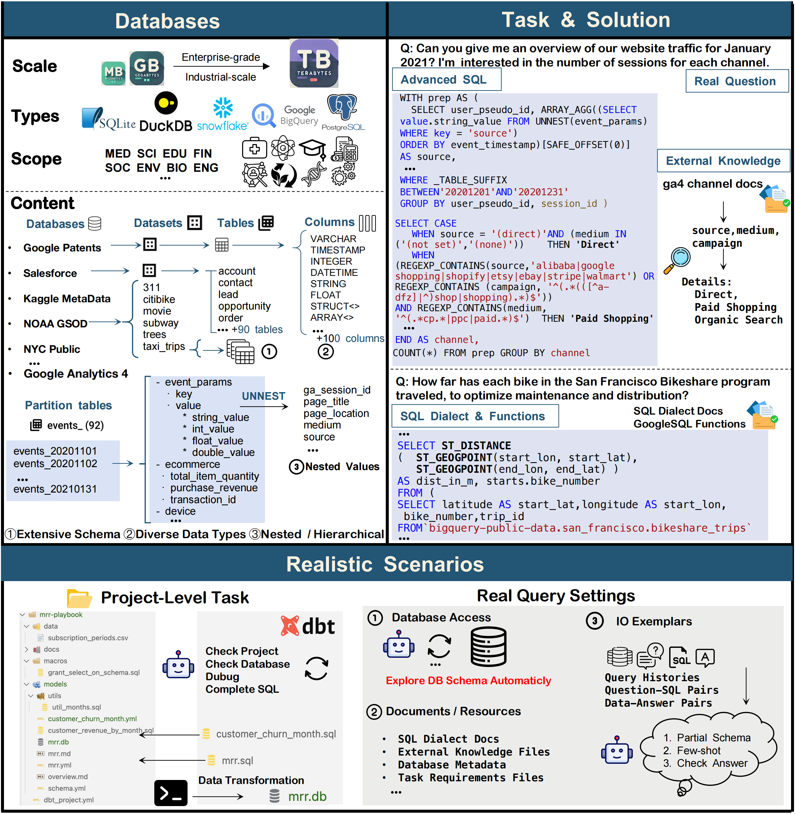

# Spider2: A Realistic and Challenging Benchmark for SQL Generation

## 📢 Updates

- 2024-09-XX: We released our paper.

## ⚙️ Settings

[Spider2-Text2SQL](https://github.com/xlang-ai/Spider2/tree/main/Spider2-Text2SQL): **Traditional Text2SQL Setting**. Focusing on Text2SQL, with detailed database metadata and excluding project-level tasks.

[Spider2-C](https://github.com/xlang-ai/Spider2/tree/main/Spider2-C): **Comprehensive code agent setting**. It needs to automatically explore complex database, using Python, SQL, and Command-line to solve complex SQL generation and project-level tasks.