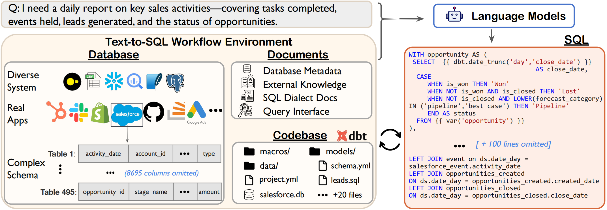

# Spider 2.0: Can Language Models Resolve Real-World Enterprise Text-to-SQL Workflows?

## 📰 News

- 2024-08-28: We released a smaller version of Spider 2.0 (~ 25% of the full dataset) containing 190 examples to give users early access. The full dataset and the paper will be available in two weeks. Stay tuned! 🤗

## 👋 Overview

### Why Spider 2.0?

In 2018, our group proposed [Spider 1.0](https://yale-lily.github.io/spider), which has been widely used in Text-to-SQL research. 

Real-world enterprise-level Text-to-SQL workflows often involve complex data and require advanced SQL queries across various operations. **We lack a comprehensive testbed to fully evaluate and develop Text-to-SQL capabilities.**

To this end, we introduce Spider 2.0, an evaluation framework of real-world SQL generation tasks across enterprise-grade databases and diverse realistic scenarios.

We evaluate Spider 1.0, BIRD, Spider2.0 using the same popular framework [Dail-SQL](https://github.com/BeachWang/DAIL-SQL).

|                    | Spider 1.0 | BIRD  | Spider 2.0 |
|--------------------|------------|-------|------------|
| DailSQL + GPT-4    | 86.6       | 57.4  | 6.0        |

## 🚀 Quickstart

For [`Spider 2.0`](https://github.com/xlang-ai/Spider2/tree/main/spider2) , we proposed an agent framework [`Spider-Agent`](https://github.com/xlang-ai/Spider2/tree/main/spider-agent) baseline based on Docker ENV. 

[`Spider 2.0-Lite`](https://github.com/xlang-ai/Spider2/tree/main/spider2-lite) covers 90% of examples from Spider 2.0 that are sampled to be more lightweight and standalone, with a focus on evaluating LLMs on classic Text-to-SQL.

## Spider 2.0 Baselines

#### Performance

| Method                     | Score |
| -------------------------- | ---- |
| Spider-Agent + GPT-4o   | 9.25% |

> We will test more LLMs and Agent Frameworks! 
>
> We also warmly welcome you to evaluate your methods on Spider 2.0.

## Spider 2.0-Lite Baselines

For `Spider 2.0-Lite`, we proposed baselines based on widely used text2sql methods: [`Dail-SQL`](https://github.com/xlang-ai/Spider2/blob/main/spider2-baselines/DailSQL/README.md) and [`CodeS`](https://github.com/xlang-ai/Spider2/tree/main/spider2-baselines/CodeS/README.md), with evaluation results reported :test_tube:.

### Performance Comparison

> **Score [w/ Func & w/ Plan]** represents an oracle setting, utilizing reference plans and gold SQL functions for a set of analytical experiments.

| Method                  | Score   |    Score  [w/ Func & w/ Plan]     |
| -------------------------- | ---- | -------------------------
| DailSQL + GPT-4o |  **6.04% (9/149)** |   12.75% (19/149)        |
| CodeS-7B      | 1.34% (2/149) |   2.01% (3/149)            |

