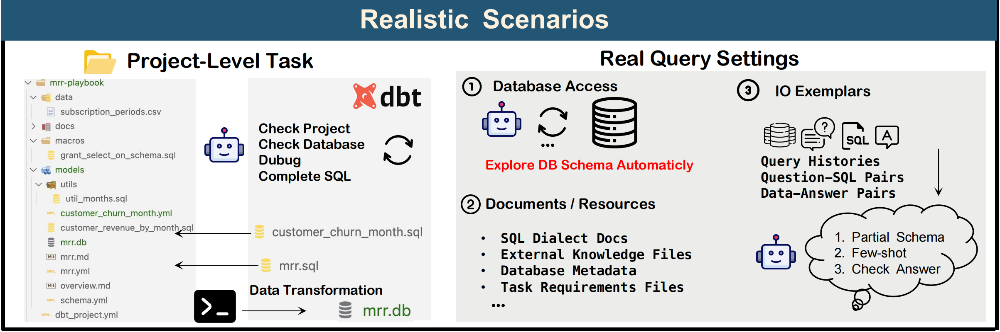

# Spider 2.0

Spider 2.0 is a challenging code generation benchmark that requires writing SQL (primarily), Python, and Command Line commands to solve problems. 😊

#### Query-level Task
The most distinctive feature, compared to classic text-to-SQL, is that it doesn't provide predefined schema information; the methods need to explore the database automatically and interactively write SQL. (Somewhat similar to the setting in [`Intercode`](https://github.com/princeton-nlp/intercode))

#### Project-level Task
We also propose a new novel SQL generation task based on the **DBT project**, which is a highly realistic SQL generation scenario commonly used in industry development, requires completing a complex data transformation task. (Somewhat similar to the setting in [`SWE-Bench`](https://www.swebench.com/).


<!--  -->


## Data content and format

For any given example, everything needed to solve this task is provided within the folder. Please ensure your agent makes full use of these resources.


All evaluation examples are in [`evaluation_examples`](https://github.com/xlang-ai/Spider2/tree/main/spider2/evaluation_examples) 


- `instance_id`: (str) - A formatted instance identifier, UUID.
- `instruction`: (str) - The question body.
- `type`: (str) - [Local, Bigquery, DBT].
- `derived_from`: (str) - [ga001 / bq003 / local027 ...]

```
{
    "instance_id": "1d009ac3-1c75-447b-a7e0-49ccc2b5fbf9", 
    "instruction": "I'm trying to evaluate which board types were most effective on September 15, 2018. Can you find out the average scores for each board type from the quick play level completions on that day?", 
    "type": "Bigquery", 
    "derived_from": "ga003"
},
{
    "instance_id": "053d2650-2188-4e58-a141-2376d5cff0a5", 
    "instruction": "Complete the project to show the metrics of each traffic source and output the transformed database, I believe every touchpoint in the conversion path is equally important, please choose the most suitable attribution method. ", 
    "type": "DBT", 
    "derived_from": "dbt001_1"
}
```

## Baseline

We proposed an agent framework [`Spider-Agent`](https://github.com/xlang-ai/Spider2/tree/main/methods/spider-agent#spider-agent) baseline with interactive environment. 


## Evaluation

We create [evaluation suite](https://github.com/xlang-ai/Spider2/tree/main/spider2/evaluation_suite#evaluation-suite) for Spider 2.0.


#### Evaluation Results


| Method                | Score  |
| --------------------- | ------ |
| Spider-Agent + GPT-4o | 10.00% |


